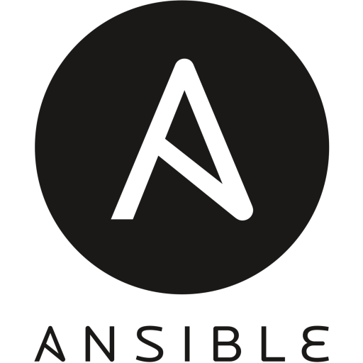

### Beep boop beep!  👋
Stay tuned to watch me blow my AWS budget on superfluous EMR cluster usage. 

## Bit about me:
- :octocat: Finally taking my projects public
- :mortar_board: Stats + CS
- :wrench: Data Plumber
- :computer: Hardware Enthusiast 
- :boxing_glove: Amateur Boxer
- :books: Network Programming In Go

### Connect with me:

[][linkedin]
[][notion]
[][instagram]
[][medium]
[][hackerrank]
 

### Languages and Tools:

  
  
  
   
  
  
  
  
  

 
 

[instagram]: https://www.instagram.com/jandy.tenedora/
[linkedin]: https://www.linkedin.com/in/jandy-tenedora/
[medium]: https://medium.com/@jandytenedora
[hackerrank]: https://www.hackerrank.com/jandy_tenedora
[notion]: https://boulder-chipmunk-8c9.notion.site/Engineering-Study-b004d4c26d59431eb052d46ee77e0304
